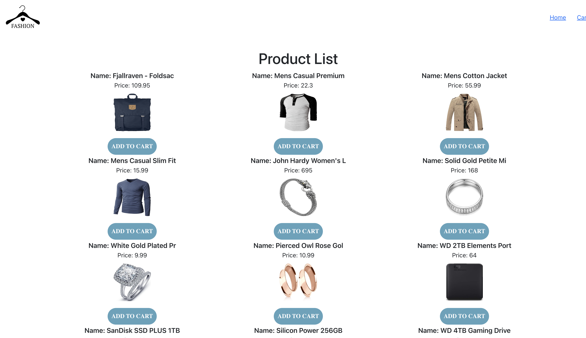
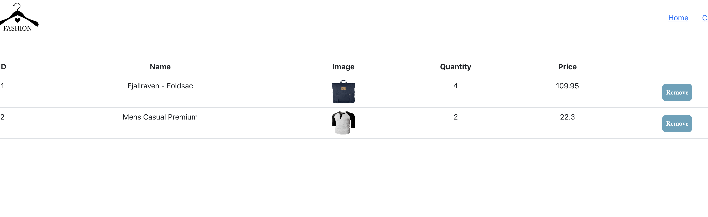

# React assignment

This assignment is to practice React : passing props, React hook: useState, useEffect and React router

## How to run project

1. Step 1: yarn
2. Step 2: yarn start

## Requirements

1. The application should have 2 pages: Home page and Cart page as the screenshots belows
2. Home page displays list of products using this url: `https://fakestoreapi.com/products`
3. When the user click `Add to cart` button, the product should display on the `Cart page` as the screenshot below
4. When the user click more than 1 time the same products, it should increase the quantity of that products instead pushing the same product in the `Cart Page`
5. Styling is up to you but at least do as the template in the screenshot

## Screenshots

## Extra task

Add 1 more page for product detail: in HomePage, each product you should add a `More` button and in the product detail page, use this url: `https://fakestoreapi.com/products/:productId` to get product detail. More detail about the API: `https://fakestoreapi.com/docs`
